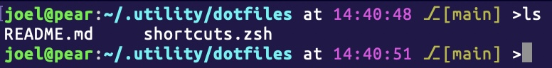

# dotfiles
Personal terminal setup and tweaks

## Features

###Personalised prompt
[user]@[hostname]:[path] at [time] [branch] >

### Swiss Army knife
#### Basic Binary-Hex-Decimal conversion
Use b for binary, d for decimal, x for heximal
`b2d(0110)`
`x2b(FF)`
`d2c(10)`

#### Reload Shell
`reload` to reload any modifications to the shell

#### ASCII Lookup
`ascii("foo bar")` to convert characters inside quotation marks into their ASCII code

#### Character count
`count("foo bar")` to count the number of characters within the quotation marks

#### Edit Shell
`edit` to open relevant files in VS Code for customisation

#### youtube-dl features
Quick features to download online media in various formats

## Setup
### zsh
Place `.zshrc` in `~/.zshrc` and `shortcuts.zsh` in `~/.utility/shortcuts.zsh`

### bash
To Do